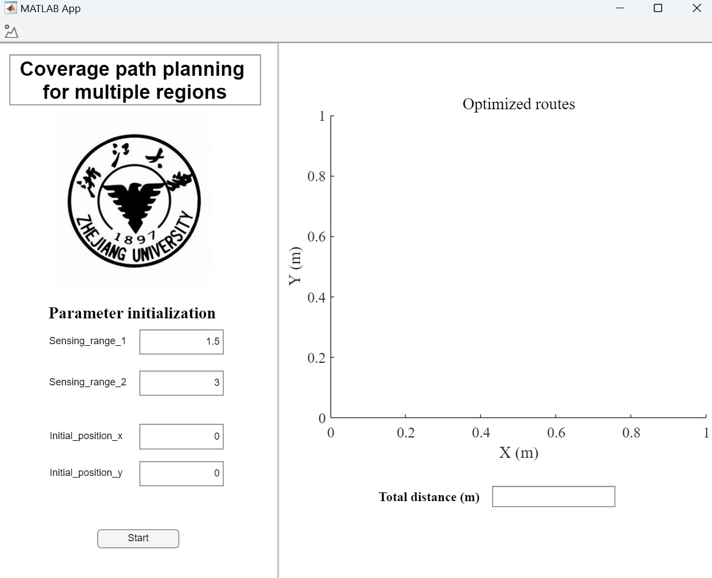
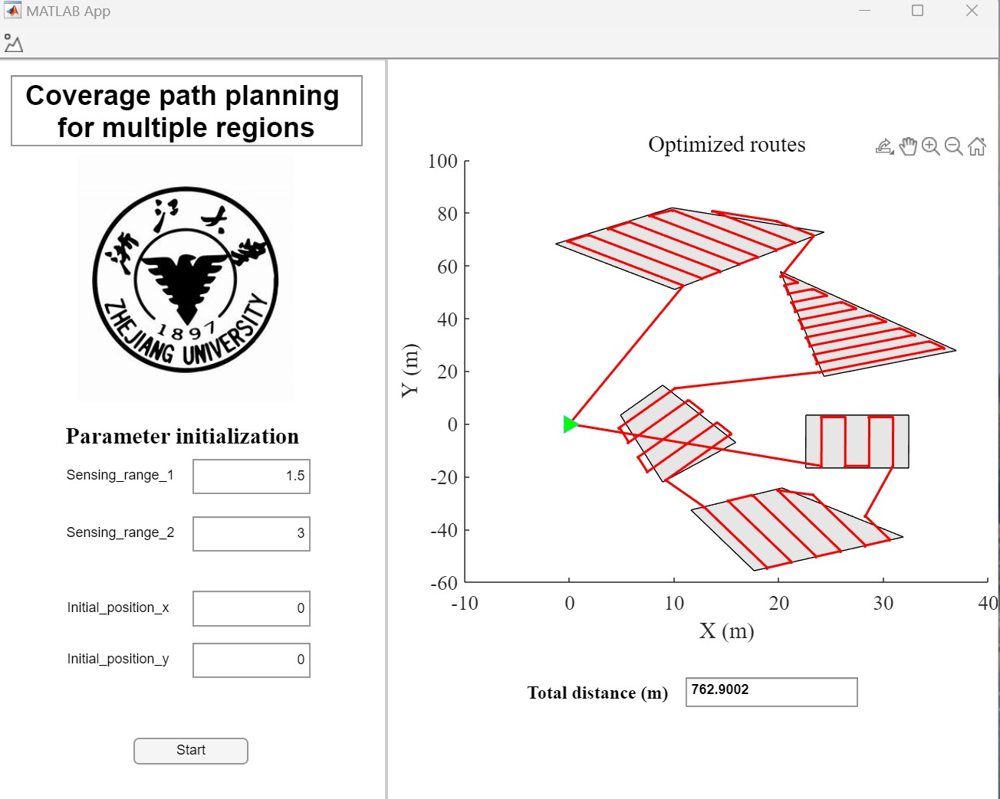
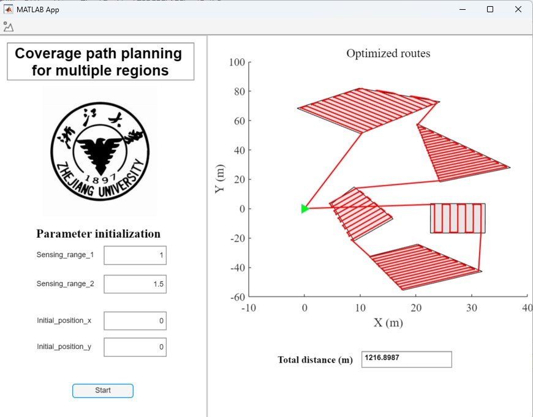
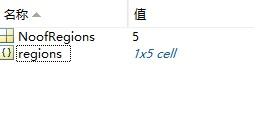

# Coverage-planning-for-USV-assisted-bathymetry
This is the official end-to-end software for coverage planning for USV-assisted bathymetry survey. 

## How to start (Download all packages at once)
### Install MATLAB Runtime and the software together
Please download the file in this [link](https://gitlab.com/liangzhao13/coverage-planning-software.git). Run the package file "MyAppInstaller_mcr.exe" which contains proper MATLAB Runtime version and the software.

### Run 
Find **coverage_app.exe** and run. Click on the **Start** button, then select the "Testcase.mat" file and run. 

## How to start (Download the packages separately)
### Install MATLAB Runtime to run the software
The software is designed by MATLAB APP Designer, therefore the MATLAB Runtime is required to properly run the APP in a independent computer. Please download the MATLAB Runtime package at this [link](https://ssd.mathworks.cn/supportfiles/downloads/R2021a/Release/6/deployment_files/installer/complete/win64/MATLAB_Runtime_R2021a_Update_6_win64.zip). Do not download other versions since they are not compatible with the software. After downloading, please unzip the file "MATLAB_Runtime_R2021a_Update_6_win64.zip" and click setup to install the MATLAB Runtime.

### Clone this repository
Clone the code with the following command:\
`git clone https://github.com/LiangZhao13/Coverage-planning-for-USV-assisted-bathymetry.git`

### Run
Find **coverage_app.exe** and run. Click on the **Start** button, then select the "Testcase.mat" file and run. 

## Example
### This is the Graphical User Interface of the software

### This is the results of the testcase

### This is the results when we modify the length and width of the sensing range

## Design your own cases
We encourage users to test their own scenarios. The ".mat" file should contain two contents: The first one is the number of regions it is "double" object. It should be named as "NooRegions" (case sensitive, make sure it is the exact same text). The second one is a "cell" object named as "regions". It contains several cells, each one represents a specific region. In each cell, the points of one region are stored in (x, y) form. 

### This is an example of the sceanrio design

### This is an illustration of designing regions

